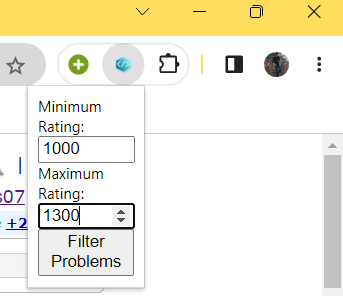

# Codeforces-Extension
# Codeforces Random Problem Chrome Extension

This is a Chrome extension that allows you to pick a random problem from Codeforces based on a specified rating range.

## Installation

1. Clone the repository or download the source code.
2. Open Google Chrome and go to `chrome://extensions`.
3. Enable the **Developer mode** (toggle switch in the top right corner).
4. Click on **Load unpacked** and select the folder containing the extension files.

## Usage

1. Click on the extension icon in the Chrome toolbar to open the popup.
2. Enter the minimum and maximum rating for the desired problem range.
3. Click on the **Filter Problems** button.
4. The extension will fetch a list of problems from Codeforces API and display a random problem within the specified rating range.
5. Click on the problem link to open it in a new tab and solve it.

## Development

If you want to make changes to the extension or customize it, follow the steps below:

1. Clone the repository or download the source code.
2. Make the necessary modifications to the code.
3. Load the modified extension in Chrome using the **Load unpacked** option in `chrome://extensions`.

## Technologies Used

- HTML
- CSS
- JavaScript
- Codeforces API

## Acknowledgements

- [Codeforces](https://codeforces.com) - The platform used to fetch the problems.

## Disclaimer

This Chrome extension is developed independently and is not affiliated with or endorsed by Codeforces. Use it at your own risk.

